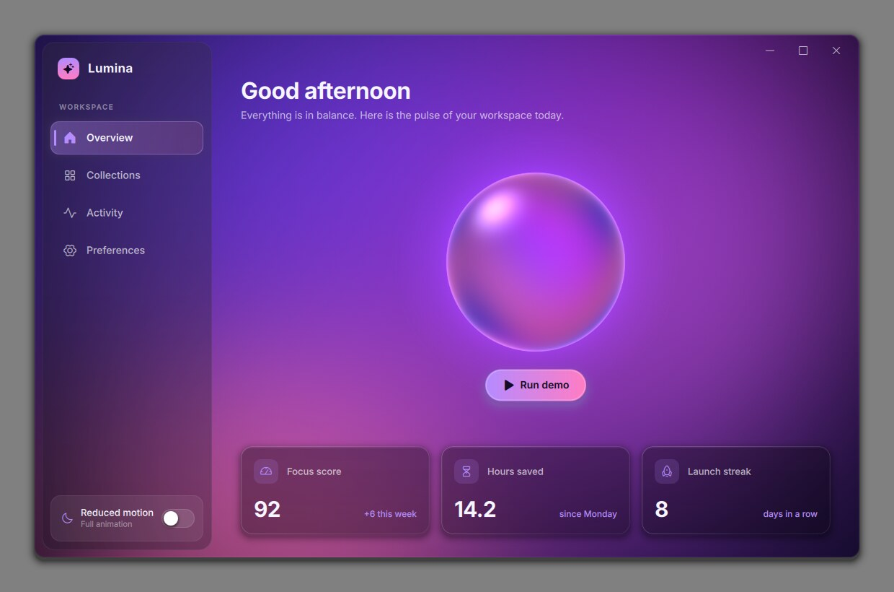
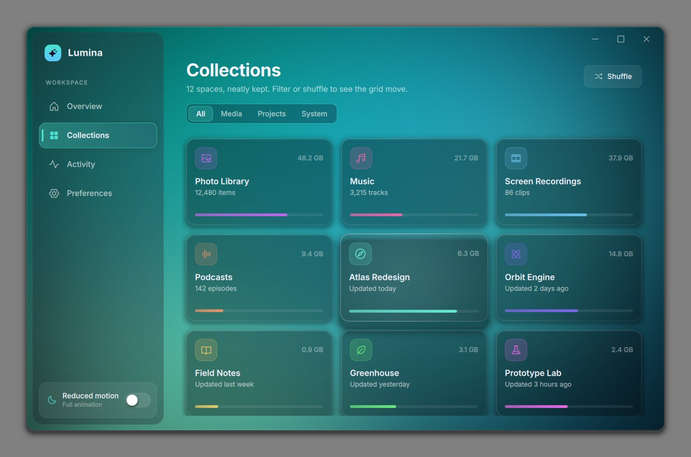
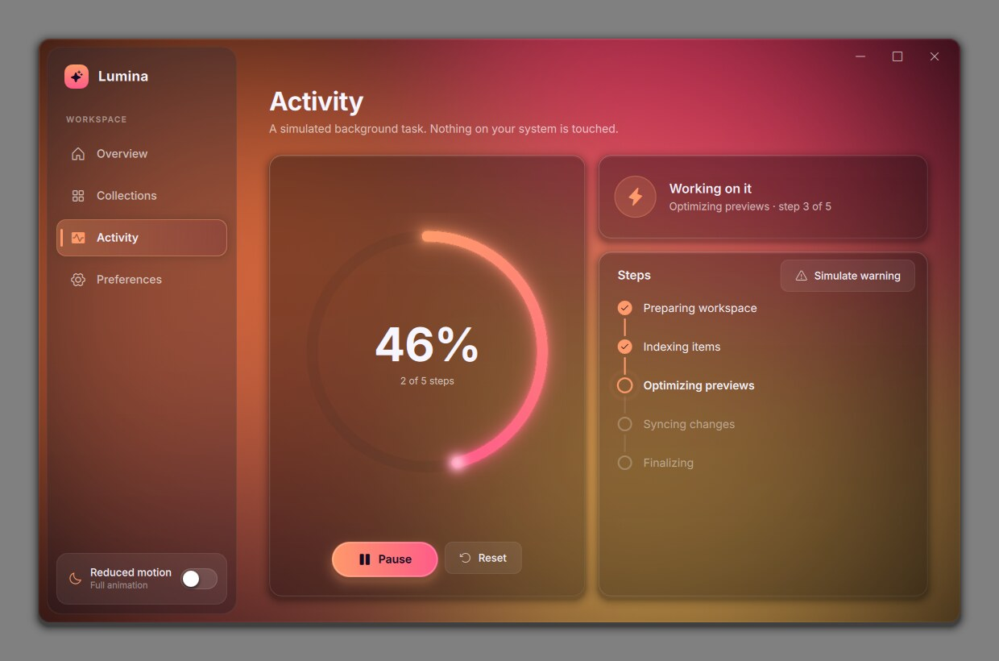
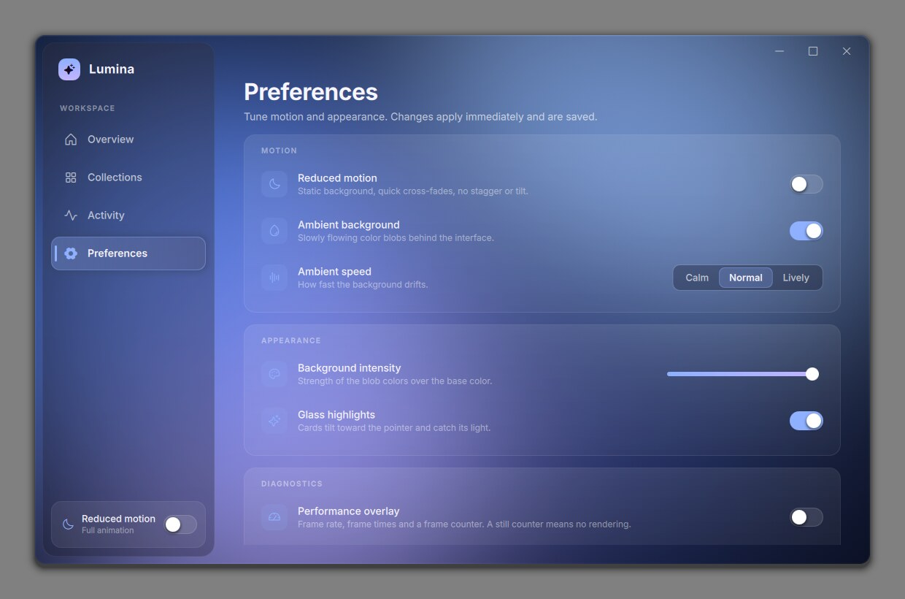

# Lumina — Qt Quick UI proof of concept

Lumina is a desktop UI proof of concept built with C++, Qt Quick/QML and CMake for Linux
and Windows. It tests appearance, animation quality and rendering cost. The content is mock
data; nothing on the system is touched.

| Overview | Collections |
|---|---|
|  |  |
| **Activity** | **Preferences** |
|  |  |

What to look for:

- **Aurora background** — slow, soft color blobs drawn by one GPU shader.
- **Section moods** — each section has its own palette. When you switch, the new palette
  spreads like ink from the icon you clicked, and every control re-tints to the new accent.
- **Liquid selection pill** — the sidebar indicator stretches toward the new item and settles.
- **Page transitions** — cross-fade with a short vertical slide; page elements arrive in a
  staggered wave. Rapid clicking retargets the animation instead of queuing it.
- **Widgets** — energy orb, progress ring with glowing tip, status card, step timeline,
  squash-and-stretch toggle, glass cards that tilt toward the pointer and catch its light.
- **Frameless window** — custom title area, real rounded corners, resizable from all edges.

The design and the reasoning behind it are in [docs/IMPLEMENTATION_PLAN.md](docs/IMPLEMENTATION_PLAN.md).

## Requirements

- CMake 3.21 or newer, Ninja (recommended), a C++17 compiler
- **Qt 6.8** (supported target; CI and releases use 6.8.3). The code also builds with Qt 6.4.
- Qt modules: **Qt Quick**, **Qt Quick Controls**, **Qt Shader Tools** (compiles the shaders
  at build time)

## Build on Windows

Install Qt with the Qt Online Installer. Select a MinGW kit and the **Qt Shader Tools**
component. Replace the paths below with your Qt version and kit:

```powershell
$env:Path = "C:\Qt\6.11.1\mingw_64\bin;C:\Qt\Tools\mingw1310_64\bin;$env:Path"
cmake -S . -B build -G Ninja `
  -DCMAKE_PREFIX_PATH="C:/Qt/6.11.1/mingw_64" `
  -DCMAKE_CXX_COMPILER="C:/Qt/Tools/mingw1310_64/bin/g++.exe"
cmake --build build --parallel
```

Run `build\Lumina.exe`. To use Qt's MSVC kit instead, use a Visual Studio developer terminal
and point `CMAKE_PREFIX_PATH` to that kit.

## Build on Linux

Install a compiler, CMake, Ninja and Qt 6 with Quick, Quick Controls and Shader Tools. On
Ubuntu 24.04 (its packages are Qt 6.4):

```bash
sudo apt install build-essential cmake ninja-build libgl1-mesa-dev \
  qt6-base-dev qt6-declarative-dev qt6-shadertools-dev \
  qml6-module-qtquick qml6-module-qtquick-controls qml6-module-qtquick-templates \
  qml6-module-qtquick-window qml6-module-qtqml-workerscript
```

Configure, build and run from the project root:

```bash
cmake -S . -B build -G Ninja
cmake --build build --parallel
./build/Lumina
```

If Qt is installed outside the system paths, pass `-DCMAKE_PREFIX_PATH=<qt prefix>` when
configuring. The project always uses the single `build` folder; to start fresh, delete it
and configure again.

## Run options

| Option | Effect |
|---|---|
| `--reduced-motion` | Start in reduced-motion mode for this session. |
| `--no-translucency` | Opaque window with square corners (for X11 without a compositor). |
| `--tour <dir>` | Automated tour: visits every section, saves screenshots to `<dir>`, runs a rapid-switching check, prints `TOUR stress OK` or `FAILED`, then quits. |
| `--settings <file>` | Use another settings file (default: the user config folder). |

Keyboard: `Ctrl+1` … `Ctrl+4` switch sections, `Up`/`Down` move in the sidebar, `Tab`
moves focus.

## Tests

```bash
ctest --test-dir build --output-on-failure
```

Unit tests cover the mock task state machine, the collection model (filtering and shuffling
must emit fine-grained model signals so the grid can animate) and settings persistence.

CI (`.github/workflows/ci.yml`) builds and tests on every push for Linux and Windows with
Qt 6.8.3. On Linux it also runs the `--tour` under Xvfb and uploads the screenshots as the
`tour-screenshots` artifact.

## Where visual settings live

All design values are centralized in `src/qml/theme/`:

| File | Contents |
|---|---|
| `Theme.qml` | Typography, spacing scale, corner radii, window sizes, text and glass colors, status colors, ambient frame rate and speeds, and the animated current accent. |
| `Motion.qml` | Every duration, distance and easing curve. In reduced-motion mode the same names resolve to short fades or zero, so components need no special cases. |
| `Palettes.qml` | The four section moods: blob colors, base color, accent colors. |
| `Icons.qml` | Glyph names of the bundled Phosphor icon font. |

Shader effects are in `src/shaders/` (aurora background, glass card, progress ring, orb,
soft shadow/glow). Their tunable inputs are QML properties on the matching components in
`src/qml/effects/` and `src/qml/controls/`.

## Project layout

```
src/                 C++: app setup, settings, mock models, ambient clock, frame stats,
                     window chrome and its platform files (PlatformWindow*.cpp)
src/qml/             QML: Main.qml, theme/, shell/ (window frame), navigation/, pages/,
                     controls/ (reusable widgets), effects/ (shader components)
src/shaders/         GLSL fragment shaders, compiled to .qsb at build time
resources/fonts/     Inter (OFL) and Phosphor icon font (MIT), with license files
tests/               Qt Test unit tests
docs/                PRD, implementation plan, screenshots
```

## Platform behavior and limits

**Linux.** The window is frameless and per-pixel transparent: the corners are real alpha and
the soft shadow is drawn in a transparent margin that also acts as the resize border (like
GNOME client-side decorations). Moving and resizing go through the window manager
(`startSystemMove` / `startSystemResize`), so snapping and tiling work as usual. When
maximized, the margin, shadow and corner radius go away.
- X11 needs a compositing window manager for transparency. Without one the corners are
  black; use `--no-translucency`.
- Wayland: Wayland cannot report "minimized" to apps, so ambient motion keeps its timer
  running there; compositors normally stop frame callbacks for hidden windows, so little or
  no rendering happens. Not tested (see below).

**Windows 11.** The window is frameless and opaque. Rounded corners are requested from the
OS (`DWMWA_WINDOW_CORNER_PREFERENCE`), so they are antialiased by Windows itself. Moving
(including Aero Snap by dragging) and resizing go through `startSystemMove` /
`startSystemResize`.

**Windows 10.** Square corners (agreed for this proof of concept; Windows 10 has no native
rounded window corners).

Known gaps: the Windows 11 Snap Layouts flyout on the maximize button is not implemented, and
a native drop shadow under the frameless window on Windows is not guaranteed.

## Verification and measurements

Done in this repository's cloud environment: Ubuntu 24.04, Qt 6.4.2, Xvfb with **Mesa
llvmpipe software rendering** (no GPU), Openbox window manager and xcompmgr compositor,
4 CPU cores. CI repeats the build, tests and tour with Qt 6.8.3.

Checked:
- All four sections and the transitions between them; a mid-transition screenshot shows the
  cross-fade and the mood spread.
- Rapid switching: 40 section changes at 50 ms intervals; afterwards exactly one page is
  fully visible and all others are fully hidden (the `--tour` check, also in CI).
- Window: double-click title to maximize/restore (fills the screen, square corners, restore
  icon); drag to move; resize from an edge and a corner; minimum size is respected.
- Display scaling: 125% and 200% (`QT_SCALE_FACTOR`); text, icons and corners stay sharp.
- Widgets, used interactively: task start/progress/step states, the reduced-motion toggle
  (rendering stops at once and the choice is saved), card hover tilt. Checked visually only:
  disabled buttons, slider, segmented control.
- No QML warnings at startup or during the tour (Qt 6.4 and Qt 6.8).

Measured CPU and memory (20-second samples; CPU as % of one core):

| State | CPU | Memory (RSS) | Frames per second |
|---|---|---|---|
| Overview, ambient motion running | 178% | 193 MB | 30 |
| Window minimized | 0% | 193 MB | 0 |
| Reduced motion, idle | 0% | 174 MB | 0 |
| Ambient motion switched off, idle | 0% | 179 MB | 0 |

How to read these numbers:
- The 0% rows are the important result: when nothing needs to move, the app renders no frames
  and uses no CPU.
- The 178% is almost entirely **software rendering** (llvmpipe draws every pixel on the CPU).
  On a real GPU the same work moves to the GPU; that number is not measured here. Estimate
  for a desktop GPU: a few percent of one CPU core and well under 1 ms of GPU time per frame,
  to be confirmed on real hardware.
- Memory includes the software renderer; with a GPU driver it will differ.

Two measurements changed the design (details in the plan):
- A QML `Timer` keeps Qt Quick's animation system, and with it rendering, at full display
  rate. The ambient clock is therefore a C++ `QTimer`, and the window really renders at
  30 frames per second when only the background moves.
- Rendering the background at reduced resolution through a layer made Qt Quick render one
  extra frame per update (60 instead of 30). The background is now one full-resolution pass.

**Not tested here:** running on Windows 10/11 (CI compiles and unit-tests the Windows build
but cannot show a window), Wayland, real GPU performance, multi-monitor setups with mixed
scaling, and Qt 6.11.

To measure on your machine: enable **Preferences → Performance overlay** (FPS, frame times
and a frame counter; a still counter means no rendering). For GPU timing on Linux, run with
`QSG_RENDER_TIMING=1`. CPU and memory: Task Manager on Windows, `top` on Linux.

## GitHub releases

Push a version tag such as `v1.0.0` to build and publish portable packages for Windows x64
and Linux x64:

```bash
git tag v1.0.0
git push origin v1.0.0
```

The workflow attaches `qt-custom-ui-app-windows-x64.zip` and
`qt-custom-ui-app-linux-x64.tar.gz` to the GitHub Release. The Windows archive contains the
executable and the Qt runtime. The Linux archive contains an AppDir folder with its launcher
and bundled Qt runtime; Linux system libraries and a compatible graphics stack are still
required.
